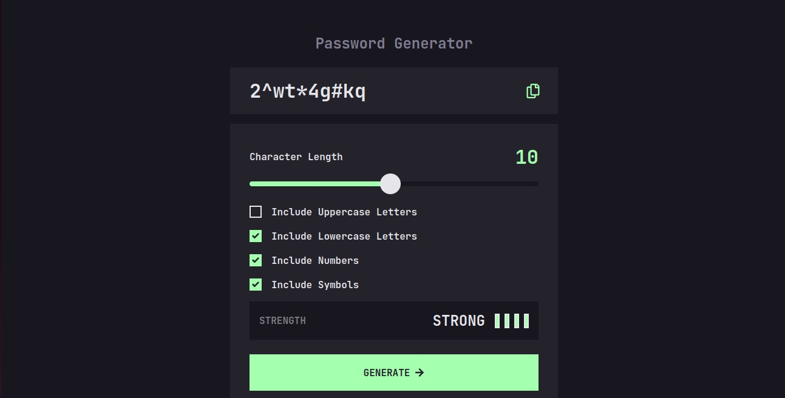
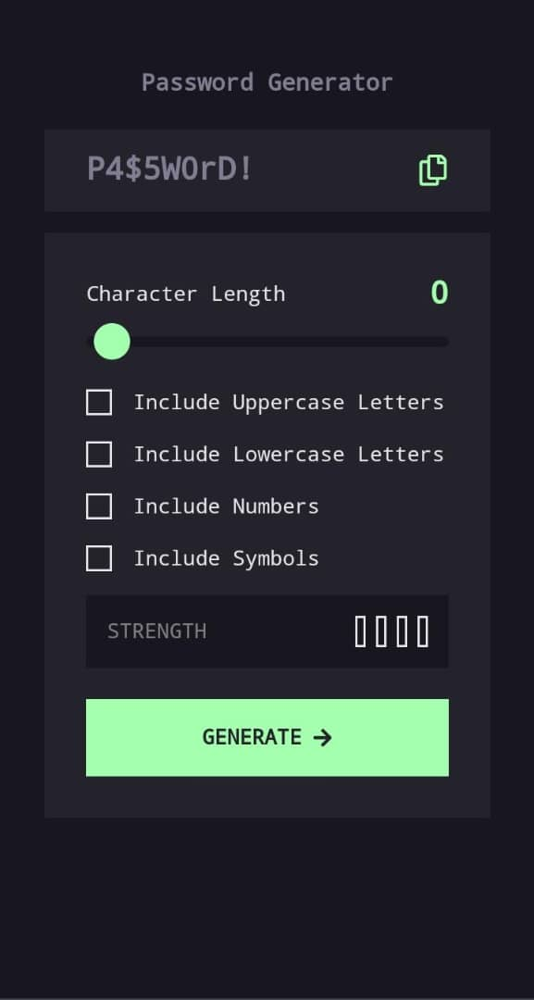

# Password Generator App

A highly customizable and responsive Password Generator built with React Vite, TypeScript, and Tailwind CSS. This application allows users to generate strong and secure passwords with various configurable options such as including uppercase letters, lowercase letters, numbers, and symbols. The application also provides a visual indicator of the password strength.



## Table of Contents

- [Overview](#overview)
  - [The challenge](#the-challenge)
  - [Screenshot](#screenshot)
  - [Links](#links)
- [My process](#my-process)
  - [Built with](#built-with)
  - [What I learned](#what-i-learned)
  - [Continued development](#continued-development)
  - [Useful resources](#useful-resources)
- [Author](#author)
- [Acknowledgments](#acknowledgments)

## Overview

### The challenge

Users should be able to:

- Generate a password based on the selected inclusion options
- Copy the generated password to the computer's clipboard
- See a strength rating for their generated password
- View the optimal layout for the interface depending on their device's screen size
- See hover and focus states for all interactive elements on the page

## Screenshot

### Desktop View


### Mobile View


### Links

- Solution URL: [GitHub Repository](https://github.com/Ej-Devs/Password-Generator.git)
- Live Site URL: [Live Demo](https://generate-password-inky-iota.vercel.app/)

## My process

### Built with

- Semantic HTML5 markup
- CSS custom properties
- Flexbox
- CSS Grid
- Mobile-first workflow
- [React](https://reactjs.org/) - JS library
- [TypeScript](https://www.typescriptlang.org/) - Typed JavaScript
- [Vite](https://vitejs.dev/) - Next Generation Frontend Tooling
- [Tailwind CSS](https://tailwindcss.com/) - Utility-first CSS framework
- [styled-components](https://styled-components.com/) - Visual primitives for the component age
- [React Icons](https://react-icons.github.io/react-icons/) - Popular icons in React

### What I learned

Working on this project helped me to reinforce my understanding of React and TypeScript. I also got more comfortable using styled-components with Tailwind CSS for styling and managing responsive layouts. Here are some specific things I learned:

```js
const generatePassword = () => {
  const upperSet = "ABCDEFGHIJKLMNOPQRSTUVWXYZ";
  const lowerSet = "abcdefghijklmnopqrstuvwxyz";
  const numberSet = "0123456789";
  const symbolSet = "!@#$%^&*()_+[]{}|;:',.<>?/~`";

  let characterSet = "";
  if (includeUpper) characterSet += upperSet;
  if (includeLower) characterSet += lowerSet;
  if (includeNumbers) characterSet += numberSet;
  if (includeSymbols) characterSet += symbolSet;

  let generatedPassword = "";
  for (let i = 0; i < length; i++) {
    const randomIndex = Math.floor(Math.random() * characterSet.length);
    generatedPassword += characterSet[randomIndex];
  }

  setPassword(generatedPassword);
  calculateStrength(generatedPassword);
};
```
Using styled-components for dynamic styling:

```js
import styled from 'styled-components';

const Slider = styled.input.attrs({ type: 'range' })<{ length: number }>`
  -webkit-appearance: none; 
  appearance: none;
  width: 100%;
  height: 2px;
  border-radius: 4px;
  outline: none;
  background: ${(props) =>
    `linear-gradient(to right, #A4FFAF 0%, #A4FFAF ${(props.length / 20) * 100}%, #18171F ${(props.length / 20) * 100}%, #18171F 100%)`};

  &::-webkit-slider-thumb {
    -webkit-appearance: none;
    appearance: none;
    width: 28px;
    height: 28px;
    background: #A4FFAF;
    border: 3px solid #A4FFAF;
    border-radius: 50%;
    cursor: pointer;
    transition: background 0.3s ease;
    transform: translateX(6px); 
  }

  &::-webkit-slider-thumb:hover {
    background: #18171F;
  }

  &::-moz-range-thumb {
    width: 28px;
    height: 28px;
    background: #E6E5EA;
    border: 3px solid #E6E5EA;
    border-radius: 50%;
    cursor: pointer;
    transition: background 0.3s ease;
    transform: translateX(6px); 
  }

  &::-moz-range-thumb:hover {
    background: #18171F;
    border: 3px solid #A4FFAF;
  }
`;
```

### Continued development

In future projects, I want to focus more on:

- **Improving Accessibility**: Ensuring that my web applications are accessible to users with disabilities. This includes using proper ARIA attributes, semantic HTML, and testing with screen readers.
- **Enhancing Performance**: Optimizing build processes and improving the performance of my applications. This includes code splitting, lazy loading components, and using performance optimization tools.
- **Advanced TypeScript**: Exploring more advanced TypeScript features and patterns to write more robust and type-safe code. This includes learning about generics, advanced types, and type inference.
- **State Management**: Delving deeper into state management libraries such as Redux or Recoil for more complex state management needs in larger applications.

### Useful resources

- [React Documentation](https://reactjs.org/docs/getting-started.html) - Comprehensive guide and documentation on React.
- [TypeScript Handbook](https://www.typescriptlang.org/docs/handbook/intro.html) - In-depth TypeScript documentation.
- [Tailwind CSS Documentation](https://tailwindcss.com/docs) - Detailed documentation on Tailwind CSS.
- [YouTube](https://www.youtube.com/) - There are many great programming tutorials and lectures here that can help you understand complex concepts.
- [Stack Overflow](https://www.stackoverflow.com/) - A great resource for finding answers to specific programming questions.

## Author

- GitHub - [Elton Segbefia](https://github.com/Ej-Devs)
- Email - [official.elton125@gmail.com](mailto:official.elton125@gmail.com)

## Acknowledgments

Special thanks to Amalitech for providing training and learning resources during the development of this project. Your insights and traning materials were invaluable in refining and improving my skills.